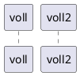

# Wrapper クラス図
```puml
class Commands{
  
  public bool startNFC()
}

class NFCSession{
  interface INFCSessionCallback
  public void initNFCSession(interface INFCSessionCallback)
  public void NFCSessionStart()
  public void NFCSessionTagScan()
  public void NFCSessionStop()
}

class OSDependNFCSession{
  public void OSDependNFCSessionStart()
  public void OSDependNFCSessionTagScan()
  public void OSDependNFCSessionStop()
}

interface INFCSessionCallback{
    public void onNFCSessionStart()
    public void onNFCSessionTagScan()
    public void onNFCSessionStop()
}

interface IShowDialog{
    public void initGUI()
    public void NFCSessionStartDialg()
    public void NFCSessionTagScanDialog()
    public void NFCSessionStopDialog()
    public void pin1EditDialog()
    public void pin2EditDialog()
    public void resetDialog()
}

class ShowDialog{
    public void initDialog()
    public void NFCSessionStartDialg()
    public void NFCSessionTagScanDialog()
    public void NFCSessionStopDialog()
    public void pin1EditDialog()
    public void pin2EditDialog()
    public void resetDialog()
}

interface ICommand {
    public void execute()
    public void errorCheck()
}

class CmdReadBinary {

}

interface INFCData {
    public void binaryToData()
}

class NFCData {
    public void setData()
    public void getData()
}

Commands o-- NFCSession
NFCSession o-- OSDependNFCSession
IShowDialog <|-- ShowDialog
Commands o-- IShowDialog
Commands <|-- INFCSessionCallback
NFCSession o-- INFCSessionCallback
ICommand <|-- CmdReadBinary
ICommand o-- Commands
INFCData <|-- NFCData
INFCData o-- Commands

```
# Wrapper シーケンス図


